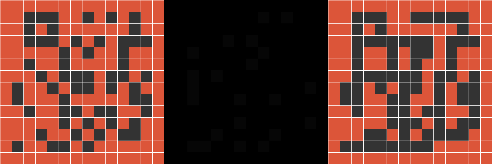
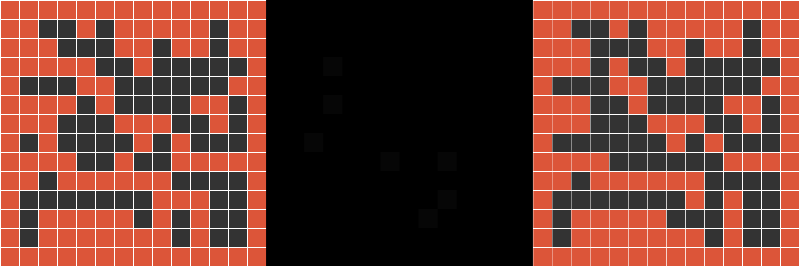
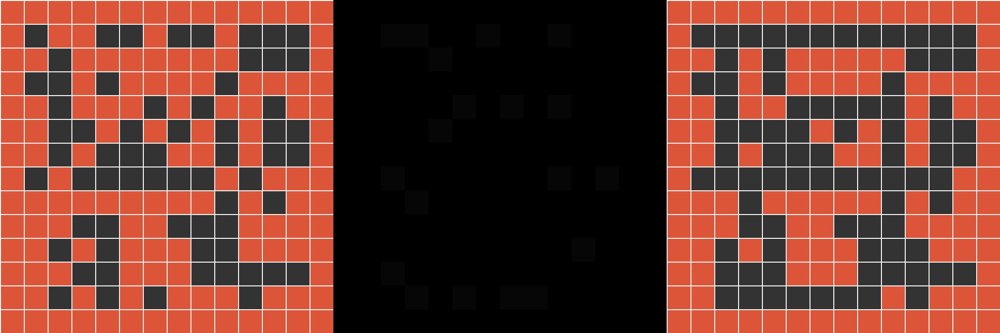

# Generative Dungeon Maps

## What Is This?

This repository implements the binary problem with the wide representation from
<a href="https://arxiv.org/abs/2001.09212"><i>PCGRL: Procedural Content Generation via Reinforcement Learning</i></a>.
The goal is to generate top-down dungeon layouts composed of solid and walkable tiles, such that the map forms a single connected region and the longest path between any two walkable tiles exceeds a target threshold. The agent edits one tile at a time anywhere on the grid, receiving reward for merging regions and lengthening paths until it meets the design criteria or runs out of edits.

## Generated Dungeons

The samples below come from a policy trained on 10×10 grids with a target path
of 5, then evaluated on 14×14 grids with a target path of 7. This was a short
training run, so inference occasionally stalled , I simply reran an the inference
when that happend.


*Episode 1 – reward 147, regions 1, path length 35, frame 22*


*Episode 2 – reward 59, regions 1, path length 42, frame 7*


*Episode 3 – reward 124, regions 1, path length 31, frame 19*

## Usage

1. **Training**  
   - Run `./train.sh` (or `uv run python train.py ...`) to launch training with the desired hyperparameters. Use `--render` if you want to see the pygame window, `--enable-wandb` to log metrics, and adjust CLI flags for map size, target path, environment probabilities, and agent hyperparameters.
2. **Inference**  
   - Run `./inference.sh` (or `uv run python inference.py ...`) pointing to a saved checkpoint (`.safetensors`). Enable `--render` to view the agent editing the grid, and set `--save-dir` to dump combined screenshots (initial layout / heatmap / final layout) per episode.
3. **Scripts / CLI**  
   - Both scripts expose all configurable knobs (grid size, target path, `prob_empty`, `change_percentage`, device/dtype selection, etc.) so you can quickly experiment without editing the code. Use `--help` on either Python entry point to see the complete list of options. All helper scripts assume the [uv](https://docs.astral.sh/uv/getting-started/installation/) project/package manager is installed and available.

## Agent

### Overview
The project uses a DQN agent that predicts two things for each state:

- A grid of Q-values, one per coordinate, telling us where to edit.
- A global “tile type” distribution that decides whether to place an empty tile (`0`) or a solid tile (`1`).

### Pseudocode
```
function act(state):
    if random() < epsilon:
        return random coordinate, random tile
    (grid_logits, tile_logits) = DQN(state)
    best_coord = argmax(grid_logits)
    best_tile = argmax(tile_logits)
    return best_coord, best_tile

function replay(batch):
    transitions = sample(memory, batch_size)
    states, actions, tiles, rewards, next_states, dones = unzip(transitions)

    curr_grid, curr_tile = DQN(states)
    next_grid_online, next_tile_online = DQN(next_states)
    next_grid_target, next_tile_target = target_DQN(next_states)

    best_coord_next = argmax(next_grid_online)
    best_tile_next = argmax(next_tile_online)

    target_q = rewards + gamma * (1 - dones) * next_grid_target[best_coord_next]
    target_tile = rewards + gamma * (1 - dones) * next_tile_target[best_tile_next]

    loss = SmoothL1(curr_grid[actions], target_q) + SmoothL1(curr_tile, target_tile)
    optimize(loss)
    periodically update target_DQN
```

### Natural Language Description
1. **Exploration / Action selection**
   - With probability `epsilon`, the agent randomly picks a coordinate and tile type to explore.
   - Otherwise, it runs the current DQN network once to get:
     - A heatmap of Q-values for each grid coordinate.
     - A two-element Q-vector for “empty” vs. “solid”.
   - The greedy action is the coordinate with the highest value, paired with the tile class that has the highest score.

2. **Training / Replay**
   - Experiences `(state, coord, tile, reward, next_state, done)` are pushed into replay memory.
   - On each replay step we sample a batch and run the online DQN on both current and next states.
   - We also run the target DQN on the next states to compute stable bootstrap targets, exactly like Double DQN.
   - The TD targets are computed separately for coordinates and tile values, clamped for stability.
   - We replace the predicted Q-values at the taken coordinate and tile with the TD targets and minimize the Smooth L1 loss.
   - After a fixed number of training steps, we sync the target network weights with the online network.

## Environment

### Overview
The environment maintains a `grid_size x grid_size` binary map (0 = walkable, 1 = solid) with a solid border, an edit heatmap, and cached stats (connected regions, longest shortest path). Episodes end either when the level becomes fully connected with enough path improvement or when an edit/iteration budget is exhausted.

### Pseudocode
```
function reset():
    map = random interior (50/50) + solid border
    heatmap = zeros
    start_stats = stats(map)
    changes = iterations = 0
    return {map, heatmap}

function step((x, y), tile):
    iterations += 1
    old_stats = stats(map)
    if map[y][x] != tile:
        map[y][x] = tile
        heatmap[y][x] += 1
        changes += 1
    new_stats = stats(map)
    reward = range_reward(new_stats, old_stats)
    budget_exhausted = changes >= max_changes or iterations >= max_iterations
    goal_met = new_stats.regions == 1 and (new_stats.path - start_stats.path) >= target_path
    done = goal_met or budget_exhausted
    return {map, heatmap}, reward, done
```

### Natural Language Description
1. **Reset**
   - Builds a square map with a solid border and random interior tiles, tracks the initial stats, zeros the heatmap, and computes the episode budgets (`max_changes`, `max_iterations`).
   - Returns both the map and heatmap as the observation tensor consumed by the agent.

2. **Step / Reward**
   - Writes the requested tile value at `(x, y)`; if it changed, increments both the “changes used” counter and the per-cell heatmap counter.
   - Recomputes the number of connected regions and the approximate longest shortest path using helper functions, comparing them to the previous stats to produce a shaped reward (positive for merging regions or lengthening paths, negative for regressions).
   - Terminates the episode either on success (single connected region with enough path improvement) or when the edit/iteration budget runs out. There’s no extra terminal bonus, the reward is whatever the shaped signal emitted on that step.


## Training

### Overview
Training drives the agent in the environment using ε-greedy exploration, stores transitions in replay memory, and periodically optimizes the DQN on random minibatches. Episodes are capped by the environment’s `max_iterations`, and checkpoints are saved every 50 episodes.

### Pseudocode
```
env = Environment(...)
agent = DQNAgent(...)
for episode in range(n_episodes):
    state = env.reset()
    state_tensor = obs_to_tensor(state)
    for step in range(env.max_iterations):
        env.render(); pygame.display.flip()
        action, tile = agent.act(state_tensor)
        next_state, reward, done = env.step(action, tile)
        next_state_tensor = obs_to_tensor(next_state)
        agent.remember(state_tensor, action, tile, reward, next_state_tensor, done)
        state_tensor = next_state_tensor
        if len(memory) >= batch_size:
            agent.replay(batch_size)
        if done: break
    if episode % 50 == 0: save_checkpoint()
```

### Natural Language Description
1. **Episode loop**
   - Resets the environment to get `{map, heatmap}`, converts it to a 2-channel tensor, and initializes `episode_reward`.
   - Steps up to `env.max_iterations`, rendering each frame if desired.

2. **Action / Environment**
   - Calls `agent.act(state_tensor)` (ε-greedy) to get `(x, y, tile)` and applies it with `env.step`.
   - Converts the resulting observation back into a tensor, accumulates reward, and stores the transition in replay memory.
   - Logs metrics (reward, epsilon, replay loss, etc.) to Weights & Biases if enabled.

3. **Learning**
   - Once the replay buffer has `batch_size` samples, calls `agent.replay(batch_size)` every step to update the DQN.
   - Every 50 episodes the model checkpoints weights to `model_output/dqn/`.
   - If the environment signals `done` (success or budget exhaustion) the episode ends early; otherwise it runs until the iteration budget is consumed.

## Inference

### Overview
Inference loads a trained checkpoint, runs one or more evaluation episodes (optionally rendering them), and saves PNGs for the initial layout, final layout, and heatmap at the end of each episode. Progress bars (tqdm) show both episode count and step count.

### Pseudocode
```
agent.load(checkpoint)
env = Environment(...)
for episode in range(num_episodes):
    obs = env.reset()
    save_initial_layout(obs)
    state = obs_to_tensor(obs)
    for step in range(env.max_iterations):
        if render: env.render(); display()
        action, tile = agent.act(state)
        obs, reward, done = env.step(action, tile)
        state = obs_to_tensor(obs)
        if done: break
    save_final_layout_and_heatmap(obs)
```

### Natural Language Description
1. **Setup**
   - Parses CLI arguments (checkpoint path, map size, episode count, target path, rendering toggle, output directory) and initializes pygame plus the environment/agent.
   - Loads checkpoint weights into the agent and fixes `epsilon=0` to ensure greedy play.

2. **Episode loop**
   - Resets the environment to get the initial observation, stores it for later image dumping, and displays a tqdm progress bar over steps.
   - Each step uses the greedy policy to select a coordinate/tile, applies it via `env.step`, optionally renders the frame, and stops early if the environment returns `done`.

3. **Saving outputs**
   - After each episode it saves three PNGs (if `--save-dir` is provided):
     - `initial_layout_epXXX.png` by temporarily swapping the environment’s map with the first state and reusing `env.render`.
     - `layout_epXXX.png` which is the final rendered screen.
     - `heatmap_epXXX.png`, a grayscale visualization of the edit counts.
   - The wrapper also prints summary stats (reward, final region count, final path length) to the console and honors window close events to exit early.
