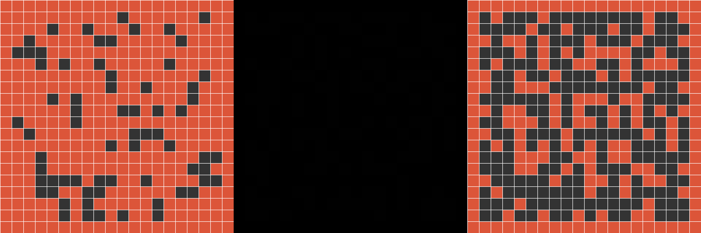
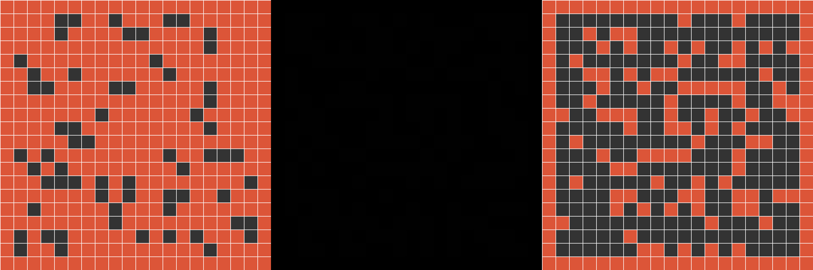
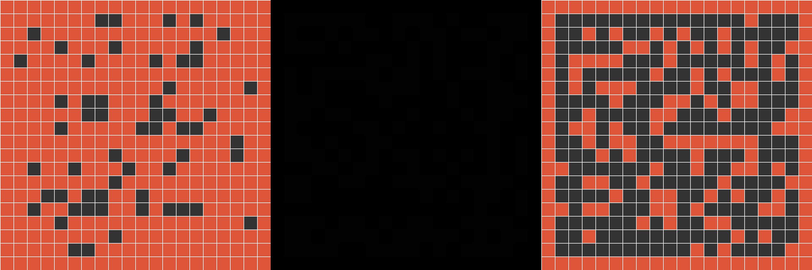

# 🧭🗺️ Generative Dungeon Maps 🏰🧩

## 📜 What Is This?

This repository implements the binary problem with the wide representation from
<a href="https://arxiv.org/abs/2001.09212"><i>PCGRL: Procedural Content Generation via Reinforcement Learning</i></a>.
The goal is to generate top-down dungeon layouts composed of solid and walkable tiles, such that the map forms a single connected region and the longest path between any two walkable tiles exceeds a target threshold. The agent edits one tile at a time anywhere on the grid, receiving reward for merging regions and lengthening paths until it meets the design criteria or runs out of edits.

## 🧱 Generated Dungeons

Try the live PPO demo on Hugging Face:
<a href="https://huggingface.co/spaces/trixyL/gdm-ppo"><b>trixyL/gdm-ppo</b></a>

The samples below are PPO inference outputs from a policy trained on 15×15 grids
with a target path of 5, then evaluated on 20×20 grids with a target path of 20.

*Episode 1 – reward 233, regions 1, path length 74, frame 233*

*Episode 2 – reward 221, regions 1, path length 44, frame 370*

*Episode 3 – reward 219, regions 1, path length 47, frame 294*

## 🛠️ Usage

1. **Training**  
   - Run `./scripts/train.sh` (or `uv run python train.py ...`) to launch training with the desired hyperparameters. Select the algorithm with `--algo dqn` or `--algo ppo`.
   - DQN example: `uv run python train.py --algo dqn --checkpoint-dir model_output/dqn`.
   - PPO example: `uv run python train.py --algo ppo --checkpoint-dir model_output/ppo --rollout-steps 512 --ppo-epochs 4 --ppo-minibatch-size 64`.
   - Use `--render` if you want to see the pygame window, `--enable-wandb` to log metrics, and adjust CLI flags for map size, target path, environment probabilities, and agent hyperparameters.
2. **Inference**  
   - Run `./scripts/inference.sh` (or `uv run python inference.py ...`) pointing to a saved checkpoint (`.safetensors`) and the matching `--algo`.
   - DQN example: `uv run python inference.py --algo dqn --checkpoint model_output/dqn/weights_1000.safetensors`.
   - PPO example: `uv run python inference.py --algo ppo --checkpoint model_output/ppo/weights_1000.safetensors`.
   - Enable `--render` to view the agent editing the grid, and set `--save-dir` to dump combined screenshots (initial layout / heatmap / final layout) per episode.
3. **Scripts / CLI**  
   - Both scripts expose all configurable knobs (grid size, target path, `prob_empty`, `change_percentage`, device/dtype selection, etc.) so you can quickly experiment without editing the code. Use `--help` on either Python entry point to see the complete list of options. All helper scripts assume the [uv](https://docs.astral.sh/uv/getting-started/installation/) project/package manager is installed and available.

## 🤖 Agent

### Overview
The project supports two algorithms selected with `--algo`:

| Algorithm | Type | Action selection | Learning data |
|---|---|---|---|
| `dqn` | value-based (Double DQN style) | `epsilon`-greedy over Q heads | replay buffer (off-policy) |
| `ppo` | actor-critic (policy gradient) | sampled policy (train), optional greedy at inference | rollout buffer (on-policy) |

Both use the same state tensor and factorized action format:
- Input: 2 channels (`map`, `heatmap`)
- Action: `(x, y, tile_value)` where `tile_value in {0,1}`

### DQN (`dqn_agent.py`)
- Model outputs:
  - coordinate Q-map (`grid_size x grid_size`)
  - tile-value Q-vector (`2`)
- Uses replay memory + target network.
- Applies border masking in action selection and TD target action selection.
- In inference, runs greedy with `epsilon = 0`.

### PPO (`ppo_agent.py`)
- Actor-critic model with shared CNN backbone and three heads:
  - coordinate logits (`grid_size * grid_size`)
  - tile logits (`2`)
  - critic value `V(s)` (scalar)
- Uses `RolloutBuffer` (on-policy data), GAE, and PPO clipped objective.
- Uses border masking in coordinate logits.
- In inference:
  - default is stochastic policy sampling
  - `--deterministic` switches to greedy policy actions

## 🌍 Environment

### State and Rules
- Grid is binary:
  - `0`: walkable
  - `1`: solid
- Border is always solid at reset.
- Border edits are blocked in `step()` (transition rule), so borders stay immutable in both training and inference.

### Observation
`reset()` and `step()` return:
- `map`: current layout
- `heatmap`: per-cell edit frequency (capped)

### Reward and Termination
- Reward is shaped from delta in:
  - number of connected regions (target: `1`)
  - longest shortest-path length (target: improve by `target_path`)
- Episode ends when either:
  - success condition is met (`regions == 1` and required path improvement), or
  - budget is exhausted (`max_changes` or `max_iterations` reached)

### Budgets
- `max_changes = int(change_percentage * grid_size^2)` (min 1)
- `max_iterations = max_changes * grid_size^2`

## 🧪 Training

### Common Flow (`train.py`)
1. Parse config + choose algorithm with `--algo {dqn,ppo}`.
2. Build environment and convert observations to 2-channel tensors.
3. Step through episodes up to `env.max_iterations`.
4. Save checkpoints every `--save-every` episodes.

### DQN Path
1. Select action with epsilon-greedy policy.
2. Store transition in replay memory.
3. Once buffer has enough samples, run replay update each step.
4. Periodically sync target network.

### PPO Path
1. Sample action from policy.
2. Store on-policy tuple in rollout buffer (`state, action, reward, done, log_prob, value`).
3. When rollout is ready (or episode ends), run PPO update:
   - compute advantages/returns (GAE)
   - run multiple epochs/minibatches with clipped objective
   - optimize actor + value + entropy terms
4. Clear rollout buffer after update.

### W&B Logging
If `--enable-wandb` is used, both algorithms log step and episode stats. PPO also logs PPO-specific losses and entropy.

## 🔮 Inference

### Common Flow (`inference.py`)
1. Load checkpoint with matching `--algo`.
2. Run episodes in the same environment rules as training.
3. Optionally render live with pygame.
4. Optionally save `initial | heatmap | final` image strips via `--save-dir`.

### Policy Mode
- DQN: greedy (inference forces `epsilon = 0`).
- PPO:
  - default: stochastic sampling
  - add `--deterministic` for greedy actions

### Fair Comparisons
For greedy-vs-greedy comparisons:
- DQN is already greedy in inference.
- Run PPO with `--deterministic`.
